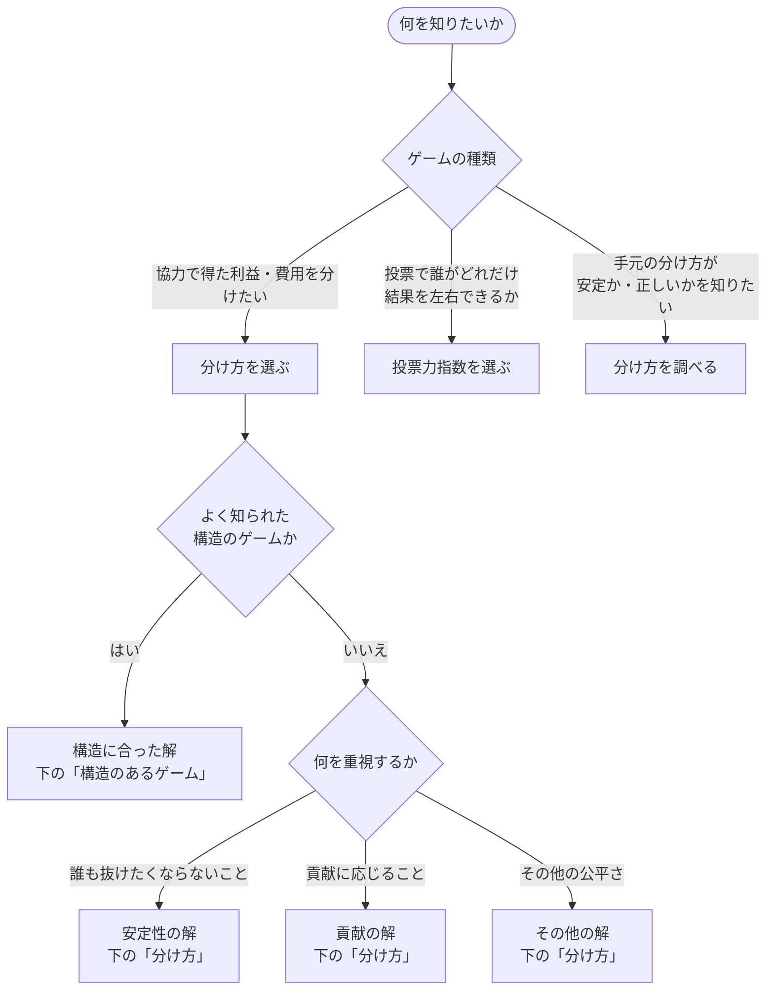
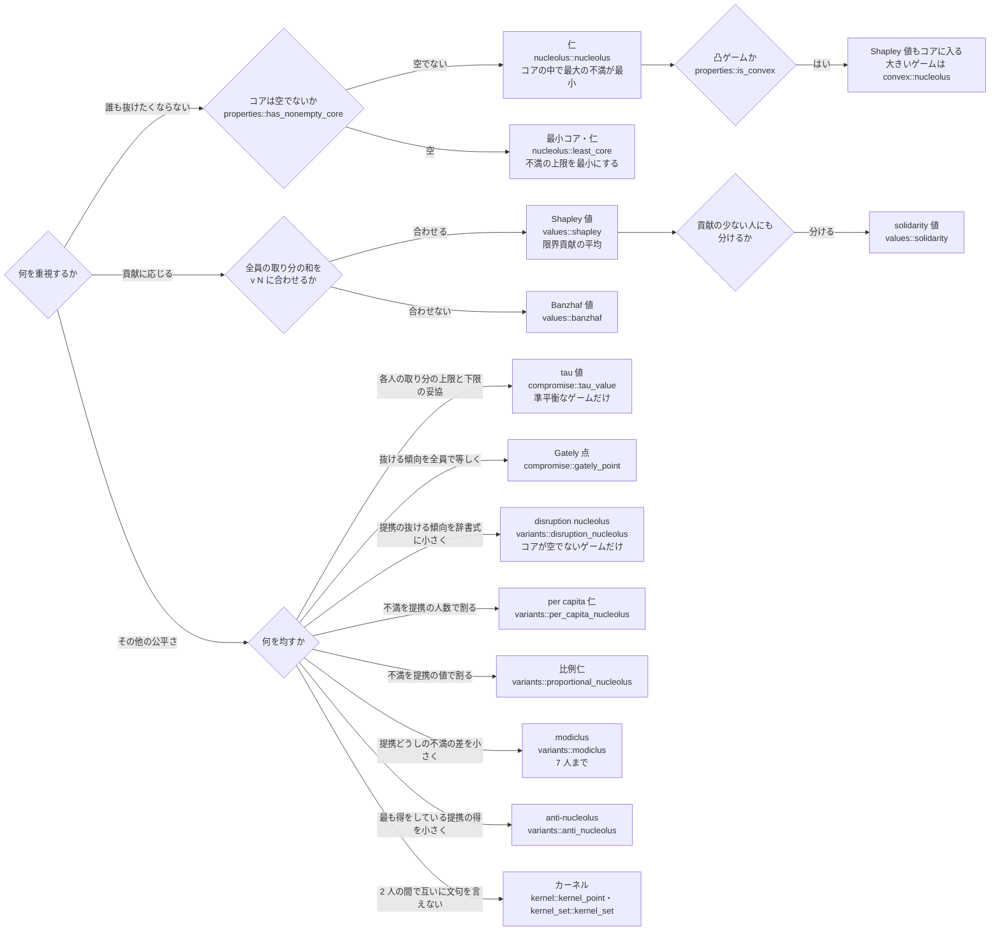
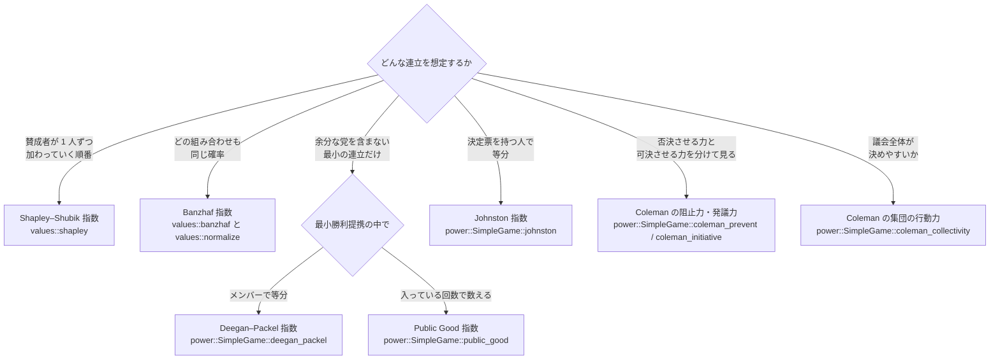

# どの解を使うか

知りたいことから、使う解 (指標) と関数を選ぶための早見図である。
解の定義と文献は [機能一覧](api-overview.md) と [参考文献](references.md) を参照。

## 全体の流れ

## 分け方 (利益・費用の配分)

## 構造のあるゲーム

| ゲームの形 | 例 | 使う解 | 関数 |
|---|---|---|---|
| 請求の合計に足りない額を分ける (破産問題) | 遺産・倒産した会社の資産 | タルムード則 (破産ゲームの仁)、CEA、CEL | `bankruptcy::{talmud_rule, constrained_equal_awards, constrained_equal_losses}` |
| 最も大きい要求に合わせて作る設備の費用 (空港ゲーム) | 滑走路、共用設備の容量 | Shapley 値 (Littlechild–Owen の式)、仁 | `oracle::airport::AirportGame` |
| 供給元から全員をつなぐ費用 (最小全域木ゲーム) | 水道管、電線 | Bird 規則 (コアに入る)、仁 | `oracle::spanning_tree::SpanningTreeGame` |
| 資源を出し合う生産 (線形生産ゲーム) | 原料を持ち寄る共同生産 | 影の価格による配分 (コアに入る) | `oracle::production::LinearProductionGame` |
| 費用を分ける (費用ゲーム一般) | 共同購入、共同配送 | 費用の仁・Shapley 値 | `cost::CostGame` |
| 協力できる相手がグラフで決まる | 取引のネットワーク、通信網 | Myerson 値 | `communication::myerson` |
| 先にグループに分かれている | 会派、部署、企業連合 | Aumann–Drèze 値、Owen 値、提携構造つきの仁 | `partition::{aumann_dreze, owen, nucleolus}` |

## 投票力指数

- 重み付き投票ゲームは `oracle::voting::WeightedVotingGame` で作り、`oracle::tabulate` で明示ゲームに直してから各指数を求める。
- Public Good 指数は、重みの大きい党ほど大きいとは限らない ([51; 35, 20, 15, 15, 15] では重み 20 の党が重み 15 の党より小さい)。
- どの指数でも、どの勝利提携でも決定票を持たない党 (ダミー) は 0 になる。

## 分け方を調べる

| 知りたいこと | 関数 | CLI |
|---|---|---|
| 誰も抜けたくならないか (コアに入るか) | `properties::is_in_core` | `coopgame explain` |
| どの提携がどれだけ不満か | `explain::{report, compare}` | `coopgame explain`、`coopgame compare` |
| 求めた配分が本当に仁か (証明つき) | `kohlberg::verify`、`exact::certify` | `coopgame verify`、`coopgame certify` |
| 交渉集合に入るか (異議に反論できるか) | `bargaining::check` | `coopgame bargaining` |
| 値が不確かなとき配分がどれだけ揺れるか | `uncertainty::{monte_carlo, influence}` | `coopgame uncertainty`、`coopgame influence` |

## ゲームが大きいとき

| 状況 | 方法 |
|---|---|
| 30 人以下 | 全提携の表 (`ExplicitGame`) で全ての関数を使える。仁は制約生成で 18 人を 0.3 秒程度 ([比較](comparison.md)) |
| 破産・重み付き投票・空港など | オラクル (`oracle`) で人数の上限なく仁を求める |
| 凸ゲーム | `convex::nucleolus` (誘導部分グラフゲームで 64 人を 17 秒) |
| それ以上 (データ評価など) | `values::shapley_sampling`、`sampled::sampled_nucleolus` で近似 |

詳しくは [大きいゲーム](large-games.md) と [性能と制約](performance.md) を参照。
